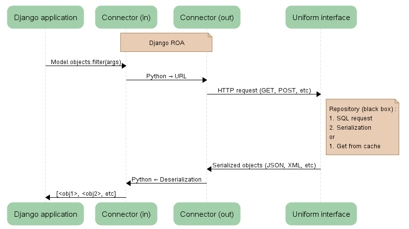

==========
Django ROA
==========

Overview
========

Django ROA is a Django application which allows you to deal with a REST API to
interact with your data in a true Resource Oriented Architecture style. It is
possible to map your models on the API and to create/retrieve/update/delete
objects as you've always done with Django's models.

You can easily switch from local storage of data to remote one given a unique
setting. That's very useful if you need to develop locally.

Python 2.4 or greater and Django 1.O or greater are required.
Restclient 0.1 and Httplib2 2.0.4 are included.

Installation
============

There are a few steps:

    * add ``django_roa`` and ``django_roa.remoteauth`` to your 
      ``INSTALLED_APPS`` setting::
      
        INSTALLED_APPS = (
            'django_roa',
            'django_roa.remoteauth',
            etc
        )
    
    * add ``RemoteUserModelBackend`` to your ``AUTHENTICATION_BACKENDS``
      setting::
      
        AUTHENTICATION_BACKENDS = (
            'django_roa.remoteauth.backends.RemoteUserModelBackend',
        )
    
    * add ``ROA_MODELS = True`` in your settings.

Basic use
=========

In order to use remote access with your models, there are 3 steps:

    * inherit from ``django_roa.Model`` for your models
    * add a custom default manager ``django_roa.Manager`` or inherit from it
      for your own managers
    * define ``resource_url_list`` Meta's variable in your
      models to access your remote resource in a RESTful way. Optionally, use 
      ``resource_url_detail`` property for your model in order to define your
      own detail url, default is::
      
          <resource_url_list><resource_url_detail>/

You can take a look at what have been done in 
``test_projects.django_roa_client/server`` for examples of use.

How does it works
=================

Each time a request should be passed to the database, an HTTP request is done
to the remote server with the rigth method (GET, POST, PUT or DELETE) given
the ``resource_url_list`` specified in model's ``Meta`` and 
``resource_url_detail`` property.

    How Django ROA handle a request

How to run tests
================

First, you need to create the remote database, go to
``test_projects/django_roa_server`` and run ``syncdb`` command to create a 
superuser named "david"::

    $ python manage.py syncdb

Now you can launch the project's server on port 8081 in order to test this 
suite with this command::

    $ python manage.py runserver 8081

Then you can go to ``test_projects/django_roa_client`` and run this command::

    $ python manage.py test

It should return no error and you will be able to see logs from the test
server which confirm that it works as expected: remote requests are done.

Note: do not try to launch tests' projects if you put ``django_roa`` 
application into your own project, otherwise it will fail. Django do not 
handle very well projects inside projects.
